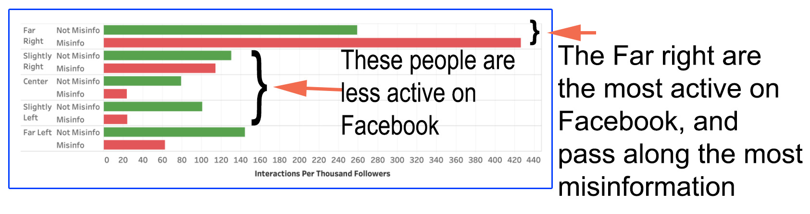

I have a friend (besides you) that produces TV shows.  He told me something that depressed him, and myself.   The TV network that his shows are produced under had to change the script of the shows to accommodate their audience.  Their audience is skewed to one side of our political divide.  He needed to change the flow of the script to not emphasize that COVID-19 was a real fact because that is what their audience believes.

I ran across this study of Facebook interactions.  They use a Facebook owned tool to analyze more than 8 million posts from almost 3,000 news and information sources over a five-month period.

