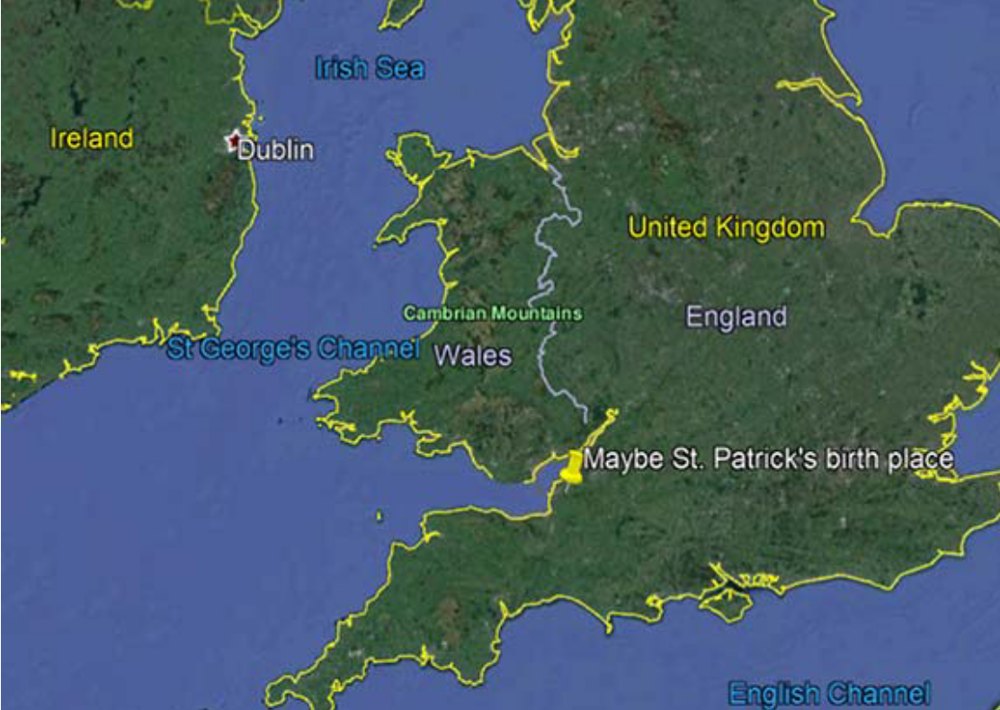

St. Patrick, considered the patron saint of Ireland, was born in, a town in Roman Britain, sometime around 380 AD.   He wrote in one of his writings:

> My name is Patrick. I am a sinner, a simple country person, and the least of all believers... My father was Calpornius. He was a deacon; his father was Potitus, a priest, who lived at Bannavem Taburniae. His home was near there, and that is where I was taken prisoner.

So Patrick wasn’t Irish—and his name wasn’t Patrick, either. It was Maewyn Succat, but he chose to be known as Patricius down the line. He actually had many monikers throughout his life: he was known by many as Magonus, by others as Succetus, and to some as Cothirthiacus.

His father, Calpornius, was a deacon in the early Christian church, but Patrick wasn’t much of a believer himself in his youth. He was captured by Irish raiders at the age of 16 and enslaved for six years as a shepherd.  It may be at this time that he “converted” to Christianity. Remember his father was a deacon and his grandfather was a priest. While in northeastern Ireland, “Patrick” learned the Irish language and culture before attempting to escape back to Britain. While on the run, he was captured this time by the French

While he was held in France, he learned all about monasticism before he was released and sent home to Britain where he continued to study Christianity. Eventually, Patrick claimed he had a vision (maybe the result of “Irish” beer) that told him to bring Christianity to the Irish people, who were predominantly pagan and druidic (a little redundant – Druids were pagan) at the time.  As a result of that vision, Patrick he made his way back to Ireland.

When Patrick arrived back in Ireland, however, he and his preaching ways were not welcomed, so he had to leave and land on some small islands off the coast of Ireland. There he began to gain followers, and he eventually moved to the Irish mainland to spread Christian ideologies across Ireland. During this time, Patrick baptized thousands of people, ordained new priests, guided women to nun hood, converted the sons of kings in the region, and aided in the formation of over 300 “churches” (not necessarily buildings).

Folklore also tells of Patrick banishing all the snakes from Ireland, but there were never actually any snakes on the island to begin with. (Let’s start a rumor that I banished all the polar bears from Newbury Park).  But, Patrick may be the one responsible for popularizing the shamrock, or that three-leafed plant you’ll see plastered all over the place on days like St. Patrick’s Day.

According to legend, Patrick used it to teach the Irish the concept of the Christian Holy Trinity. The local Druids already had triple deities and regarded the number three highly, so Patrick’s use of the shamrock may have helped him win a great deal of favor with the Irish.

These days, Patricius is known to most as Saint Patrick. Though he is not technically a canonized saint by the Catholic Church.  Below is my best guess where this “British” guy was born:

