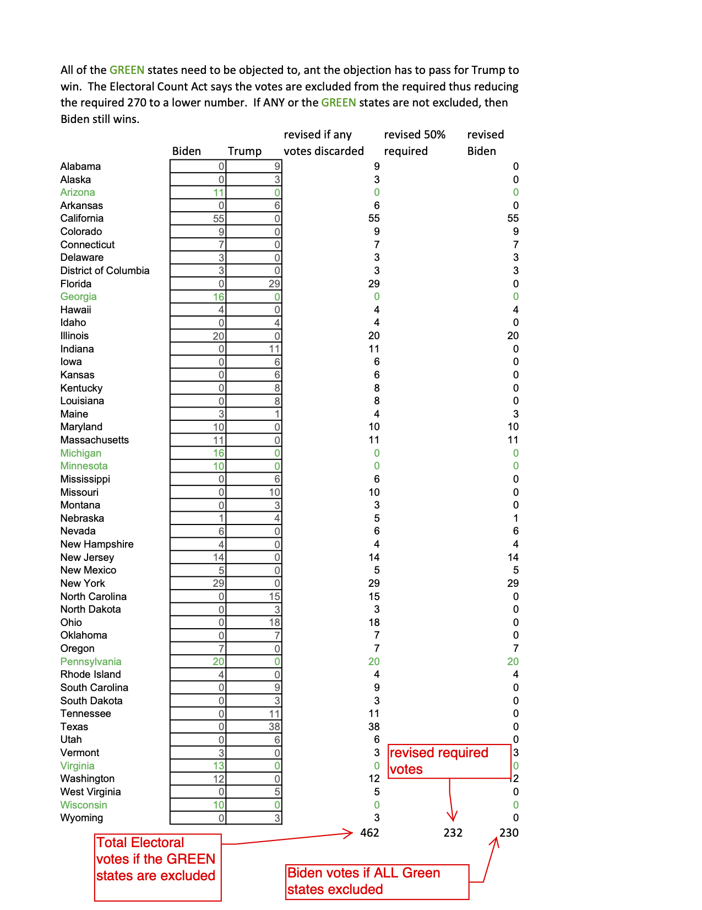

*(This was two emails, before and after the insurrection.)*

## So Even if (Jan 5)

If any state’s electoral vote were excluded, the law also says it is excluded from the total.  Thus Trump would need to exclude several states to get 50+% of the votes.

## Boy was I wrong (Jan 6)

Boy was I wrong.  I sent you an xls file named  “worst jan 6 case”.  I assumed civility...

I did not guess we would have the “Trump Riots”