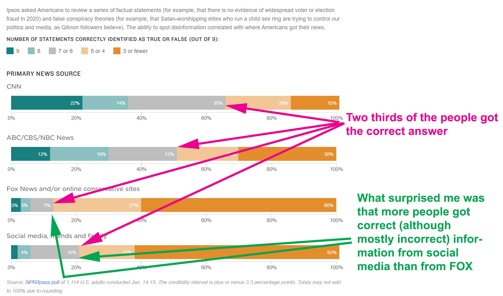

They asked a population of people a series of questions, some true, some false, on subjects being discussed in the public at this time.  All of the questions could absolutely be proven TRUE or FALSE (it was not a subjective topic).  They then asked the person where they primarily got their information.  The top of the graph I would have predicted.  I did not expect the difference in the bottom two.

Ipsos Group is a multinational market research and consulting firm with headquarters in Paris, France.  IPSOS used a survey of 1040 in this case.  For the mathematicians among you, a sample size of 1068 gives you a 95% confidence with a 3% margin of error.  To get a more accurate 2% margin you would need to more than double the sample size.  That is why you see surveys of around 1000 people.

